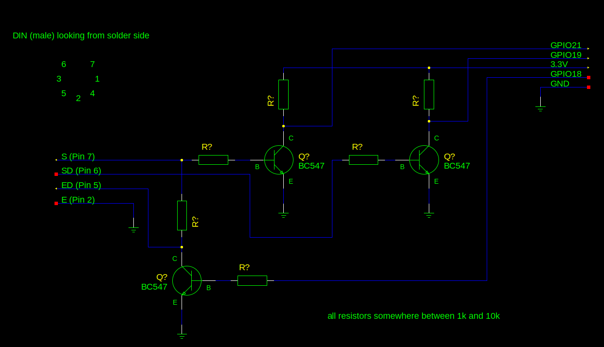

# DBT03 modem emulator for ESP32

Revive your Bildschirmtext (German Videotex) terminal! This is a simple attempt at making an emulator for the old BTX modems, type _DBT03_. It uses an Espressif ESP32 compatible WiFi module as host.

## Technical hints
DBT03 are expected to operate at an asynchronous baud rate of 1200 receiving vs. 75 sending.

## Wiring diagram

- GPIO 18 -> inverting Level Shifter -> Pin ED (5)
- GPIO 19 <- inverting Level Shifter <- Pin SD (6)
- GPOI 21 <- inverting Level Shifter <- Pin S (7)
- Ground is Pin E (2)

Be aware that the pinout of this sketch may be wrong and that pins 6 and 7 might be swapped.

